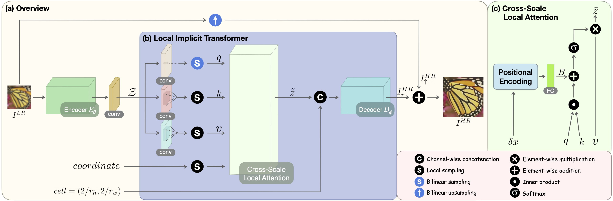
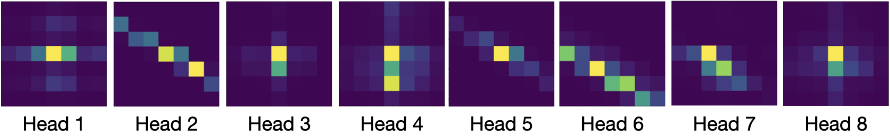

## Cascaded Local Implicit Transformer for Arbitrary-Scale Super-Resolution (CLIT)

This repository contains the PyTorch based official implementation of the paper titled: <br>
[Cascaded Local Implicit Transformer for Arbitrary-Scale Super-Resolution](https://arxiv.org/abs/2303.16513) CVPR 2023.

<center>
</img>
</center>

### Dependencies

- Python >= 3.7.0
- PyTorch >= 1.8.0

### Train

#### EDSR-Baseline

**Stage1**: `python train.py --config configs/train/train_edsr_baseline_lit.yaml --name lit_edsr`

**Stage2**: `python train.py --config configs/train/train_edsr_baseline_clit2.yaml --name clit_edsr2`

**Stage3**: `python train.py --config configs/train/train_edsr_baseline_clit3.yaml --name clit_edsr3`

#### RDN

**Stage1**: `python train.py --config configs/train/train_rdn_lit.yaml --name lit_rdn`

**Stage1**: `python train.py --config configs/train/train_rdn_clit2.yaml --name clit_rdn2`

**Stage1**: `python train.py --config configs/train/train_rdn_clit3.yaml --name clit_rdn3`

#### SwinIR

**Stage1**: `python train.py --config configs/train/train_swinir_lit.yaml --name lit_swinir`

**Stage2**: `python train.py --config configs/train/train_swinir_clit2.yaml --name clit_swinir2`

**Stage3**: `python train.py --config configs/train/train_swinir_clit3.yaml --name clit_swinir3`

$\ast$ Please note that, if you want to cascadedly train stage2 or stage3 CLIT, you need to modified the <tt>"pre_train"</tt> property in the configuration so as to load previous stage1 or stage2 model as the pre-trained model.

``` 
Ex: train the stage2 CLIT using edsr-baseline model

pre_train: save/lit_edsr/epoch-last.pth
```

### Test

#### EDSR-Baseline or RDN
`bash eval.sh "put the model name here"`

#### SwinIR
`bash eval_swinir.sh "put the model name here"`

### Demo Attention Maps

`python demo.py --model save/lit_rdn/epoch-last.pth --img_path assests/0868x4.png --scale 6`

|Inputs|Attention Heads|
|-|-|
|||


### Additional Quantitative Results

#### Div2k

| <div style="width:160px">Method (SSIM)</div> | x2 | x3 | x4 | x6 | x12 | x18 | x24 | x30 |
| ------- | :--------: | :--------: | :--------: | :--------: | :--------: | :--------: | :--------: | :--------: |
| EDSR-Baseline-CLIT | 0.9397 | 0.8790 | 0.8266 | 0.7503 | 0.6439 | 0.6006 | 0.5771 | 0.5629 |
| RDN-CLIT | 0.9418 | 0.8829 | 0.8319 | 0.7564 | 0.6497 | 0.6053 | 0.5804 | 0.5657 |
| SwinIR-CLIT | 0.9436 | 0.8859 | 0.8357 | 0.7608 | 0.6534 | 0.6080 | 0.5830 | 0.5675 |

#### Set5

| <div style="width:160px">Method (SSIM)</div> | x2 | x3 | x4 | x6 | x8 |
| ------- | :--------: | :--------: | :--------: | :--------: | :--------: |
| RDN-CLIT | 0.9474 | 0.9101 | 0.8760 | 0.8053 | 0.7451 |
| SwinIR-CLIT | 0.9482 | 0.9117 | 0.8787 | 0.8131 | 0.7521 | 

#### Set14

| <div style="width:160px">Method (SSIM)</div> | x2 | x3 | x4 | x6 | x8 |
| ------- | :--------: | :--------: | :--------: | :--------: | :--------: |
| RDN-CLIT | 0.9023 | 0.8227 | 0.7619 | 0.6748 | 0.6184 | 
| SwinIR-CLIT | 0.9030 | 0.8262 | 0.7656 | 0.6789 | 0.6210 | 

#### B100

| <div style="width:160px">Method (SSIM)</div> | x2 | x3 | x4 | x6 | x8 |
| ------- | :--------: | :--------: | :--------: | :--------: | :--------: |
| RDN-CLIT | 0.8962 | 0.8003 | 0.7304 | 0.6404 | 0.5876 | 
| SwinIR-CLIT | 0.8975 | 0.8029 | 0.7341 | 0.6443 | 0.5907 | 

#### Urban100

| <div style="width:160px">Method (SSIM)</div> | x2 | x3 | x4 | x6 | x8 |
| ------- | :--------: | :--------: | :--------: | :--------: | :--------: |
| RDN-CLIT | 0.9298 | 0.8568 | 0.7942 | 0.6918 | 0.6224 | 
| SwinIR-CLIT | 0.9335 | 0.8651 | 0.8051 | 0.7070 | 0.6369 | 

### Acknowledgements

This repo is built on [LIIF](https://github.com/yinboc/liif) and [LTE](https://github.com/jaewon-lee-b/lte). Thanks the authors for their contributions and generosity.